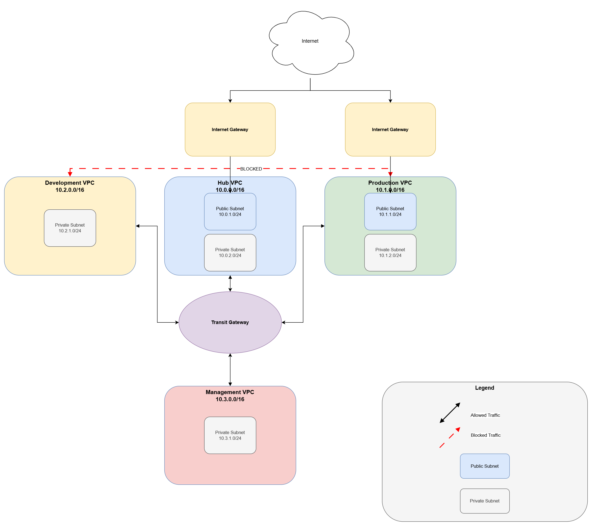

# AWS Multi-VPC Hub-and-Spoke Network Architecture

A production-grade AWS network built from scratch using a hub-and-spoke topology across 4 VPCs, enforcing strict environment isolation through defense-in-depth security across three enforcement layers.

---

## Architecture Overview

The network follows a **hub-and-spoke topology** — a standard enterprise pattern where all inter-VPC traffic flows through a central hub, rather than directly between environments. This centralizes routing policy and makes the network easier to manage and audit as it scales.

### Why hub-and-spoke?

Direct VPC peering requires n×(n-1)/2 connections — for 4 VPCs that's 6 separate peering connections, each with its own routing rules. With Transit Gateway as the hub, each VPC connects once and routing is managed centrally. This scales to hundreds of VPCs without increasing complexity.

---

## Network Design

### VPC Layout

| VPC | CIDR Block | Purpose |
|-----|-----------|---------|
| Hub VPC | `10.0.0.0/16` | Shared services, central routing hub |
| Production VPC | `10.1.0.0/16` | Live environment — strictest access controls |
| Development VPC | `10.2.0.0/16` | Testing environment — isolated from production |
| Management VPC | `10.3.0.0/16` | Admin access — reaches all other VPCs |

All CIDR blocks are non-overlapping by design. Overlapping ranges would prevent Transit Gateway from routing between VPCs — a common and irreversible mistake since VPC CIDRs cannot be changed after creation.

### Subnet Layout

| VPC | Subnet | CIDR | Type |
|-----|--------|------|------|
| Hub | hub-public-subnet | `10.0.1.0/24` | Public |
| Hub | hub-private-subnet | `10.0.2.0/24` | Private |
| Production | prod-public-subnet | `10.1.1.0/24` | Public |
| Production | prod-private-subnet | `10.1.2.0/24` | Private |
| Development | dev-private-subnet | `10.2.1.0/24` | Private |
| Management | mgmt-private-subnet | `10.3.1.0/24` | Private |

Development and Management have no public subnets — they are never directly reachable from the internet. A subnet's public or private nature is determined entirely by its route table: public subnets have a default route (`0.0.0.0/0`) pointing to an Internet Gateway; private subnets do not.

---

## Traffic Policy

The core design principle is **production-development isolation**. In a real environment, a misconfiguration or bug in development must never be able to affect production systems. The network enforces this at three separate layers.

| Source | Destination | Policy | Reason |
|--------|-------------|--------|--------|
| Production | Hub | ✅ Allow | Prod needs shared services |
| Development | Hub | ✅ Allow | Dev needs shared services |
| Management | All VPCs | ✅ Allow | Admins need full access |
| Production | Development | ❌ Block | Core isolation rule |
| Development | Production | ❌ Block | Core isolation rule |
| Internet | Production (80/443) | ✅ Allow | Web traffic |
| Internet | Development | ❌ Block | Dev is never public-facing |
| Internet | Management | ❌ Block | Admin access via VPN only |

---

## Security Model — Defense in Depth

The production-development isolation is enforced at **three independent layers**. If any single layer is misconfigured, the other two still hold.

### Layer 1 — Route Tables
No route exists between the Production and Development VPCs in their respective route tables. Traffic has no path to follow, so it is dropped before it leaves the subnet.

| Route Table | Routes |
|-------------|--------|
| hub-private-rt | 10.1.0.0/16 → TGW, 10.2.0.0/16 → TGW, 10.3.0.0/16 → TGW |
| prod-private-rt | 10.0.0.0/16 → TGW, 10.3.0.0/16 → TGW (no dev route) |
| dev-private-rt | 10.0.0.0/16 → TGW, 10.3.0.0/16 → TGW (no prod route) |
| mgmt-private-rt | 10.0.0.0/16 → TGW, 10.1.0.0/16 → TGW, 10.2.0.0/16 → TGW |

### Layer 2 — Network ACLs (NACLs)
A custom NACL (`prod-private-nacl`) is attached to the Production private subnet with an explicit deny rule for Development traffic — even if a route somehow existed.

NACLs are **stateless**, meaning both inbound and outbound rules must be explicitly defined. Rules are evaluated in order by rule number.

| Rule # | Direction | Source/Dest | Action |
|--------|-----------|-------------|--------|
| 100 | Inbound | `10.0.0.0/16` (Hub) | Allow |
| 110 | Inbound | `10.3.0.0/16` (Mgmt) | Allow |
| 120 | Inbound | `10.2.0.0/16` (Dev) | **Deny** |
| 32766 | Inbound | `0.0.0.0/0` | Allow |
| 100 | Outbound | `10.0.0.0/16` (Hub) | Allow |
| 110 | Outbound | `10.3.0.0/16` (Mgmt) | Allow |
| 120 | Outbound | `10.2.0.0/16` (Dev) | **Deny** |
| 32766 | Outbound | `0.0.0.0/0` | Allow |

### Layer 3 — Security Groups
Security Groups are **stateful** instance-level firewalls. Return traffic is automatically allowed, so only inbound rules need to be defined for most cases.

| Security Group | Inbound Rules |
|----------------|---------------|
| hub-sg | All traffic from `10.0.0.0/8` (all internal VPCs) |
| prod-sg | All traffic from `10.3.0.0/16` (Mgmt), HTTP/HTTPS from `0.0.0.0/0`, ICMP from `10.0.0.0/8` |
| dev-sg | All traffic from `10.3.0.0/16` (Mgmt), All traffic from `10.0.0.0/16` (Hub), ICMP from `10.0.0.0/8` |
| mgmt-sg | All traffic from `10.0.0.0/8` (all internal VPCs), ICMP from `10.0.0.0/8` |

**Key difference between Security Groups and NACLs:**
- Security Groups are stateful (return traffic automatically allowed) and attached to instances
- NACLs are stateless (must explicitly allow both directions) and attached to subnets
- Using both creates defense in depth — a misconfigured Security Group is backstopped by the NACL

---

## AWS Services Used

| Service | Purpose |
|---------|---------|
| VPC | Isolated private networks for each environment |
| Subnets | Network segmentation within each VPC |
| Internet Gateway | Internet access for Hub and Production public subnets |
| Transit Gateway | Central hub connecting all 4 VPCs |
| Route Tables | Traffic routing and isolation enforcement (Layer 1) |
| Network ACLs | Subnet-level firewall with explicit deny rules (Layer 2) |
| Security Groups | Instance-level stateful firewall (Layer 3) |
| EC2 | Test instances for connectivity validation |
| VPC Flow Logs | Traffic logging and audit trail to CloudWatch |
| SSM Session Manager | Secure instance access without SSH keys or bastion hosts |
| VPC Endpoints | Private connectivity to AWS services without internet access |
| IAM | Least-privilege roles for EC2 and Flow Logs |
| CloudWatch | Log storage and real-time traffic monitoring |

---

## Connectivity Testing

Test instances (Amazon Linux 2023, t3.micro) were deployed in the private subnet of each VPC and connected to via SSM Session Manager — no SSH keys, no open inbound ports, no bastion host required.

### Results

| From | To | IP | Result | Expected |
|------|----|----|--------|----------|
| Hub (`10.0.2.238`) | Production (`10.1.2.238`) | ping -c 4 | ✅ 0% packet loss | Allow |
| Hub (`10.0.2.238`) | Development (`10.2.1.115`) | ping -c 4 | ✅ 0% packet loss | Allow |
| Hub (`10.0.2.238`) | Management (`10.3.1.139`) | ping -c 4 | ✅ 0% packet loss | Allow |
| Production (`10.1.2.238`) | Development (`10.2.1.115`) | ping -c 4 | ❌ 100% packet loss | **Block** |
| Production (`10.1.2.238`) | Hub (`10.0.2.238`) | ping -c 4 | ✅ 0% packet loss | Allow |

All results match the intended traffic policy exactly. The Production → Development test confirms isolation is working across all three enforcement layers.

---

## VPC Flow Logs

VPC Flow Logs were enabled on all 4 VPCs, sending to CloudWatch Log Groups:
- `/vpc/hub-flow-logs`
- `/vpc/prod-flow-logs`
- `/vpc/dev-flow-logs`
- `/vpc/mgmt-flow-logs`

Flow Logs capture accepted and rejected traffic at the network interface level, providing a full audit trail of all network activity.

---

## What I Would Add in a Production Environment

- **AWS Network Firewall** — deep packet inspection beyond what NACLs provide
- **AWS Direct Connect or Site-to-Site VPN** — secure on-premises connectivity terminating in the Management VPC
- **VPC Endpoints for all AWS services** — eliminate all internet-bound traffic from private subnets
- **AWS GuardDuty** — threat detection using VPC Flow Logs and DNS logs
- **AWS Config** — continuous compliance monitoring for network rule changes
- **Centralized logging** — aggregate all Flow Logs into a single security account

---

## Project Timeline

- **Design & Architecture:** June 2026
- **Build & Configuration:** June 2026
- **Security Hardening:** June 2026
- **Testing & Documentation:** June 2026

---

*Built by Naji Nashawaty — [LinkedIn](https://www.linkedin.com/in/naji-nachawati-a559a2281)*
